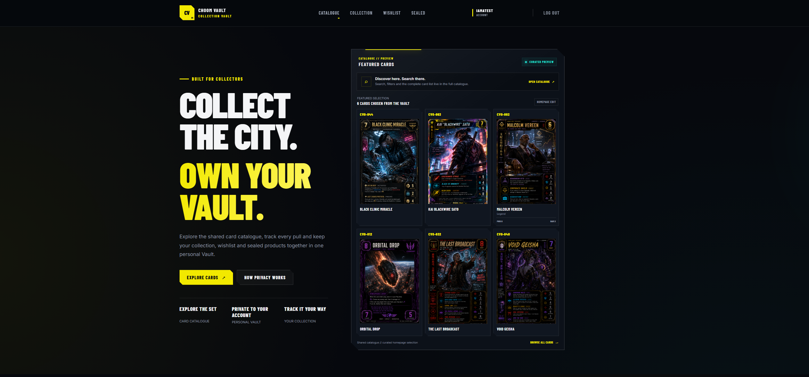
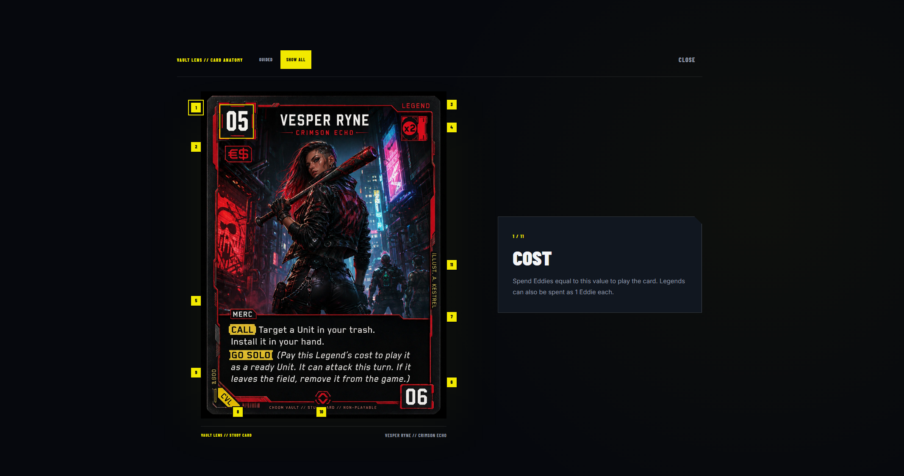
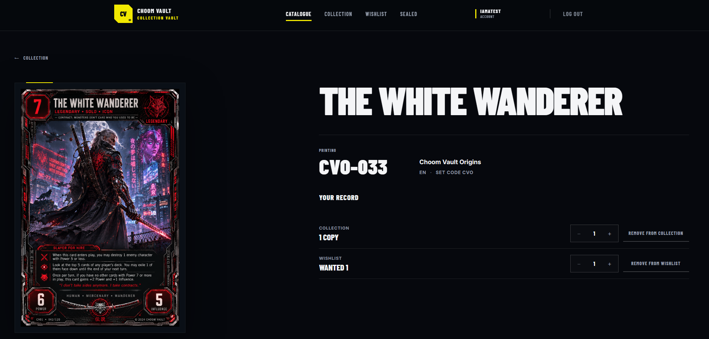

# Choom Vault

[](https://github.com/Grit-Dev/CyberpunkTcgVault/actions/workflows/ci.yml)

**Choom Vault** is a full-stack collector companion for the Cyberpunk Trading Card Game, built with **C# / .NET 10, ASP.NET Core, Angular, Entity Framework Core, SQL Server and Azure**.

I started the project because I wanted to build something around a hobby I genuinely care about while pushing beyond small coding exercises into a complete product: frontend, backend, database, authentication, security, testing, CI/CD and production deployment.

The Collector MVP is built around a simple loop:

**Discover → Inspect → Own or Want → Manage → Return**

> Choom Vault is an independent, fan-made and currently non-commercial project. It is not affiliated with, sponsored by or endorsed by CD PROJEKT RED, WeirdCo or NetDeck.

**Version 1 status:** Live Collector MVP

**Live:** https://choomvault.com

**GitHub:** https://github.com/Grit-Dev/CyberpunkTcgVault

**Release verification:** 295 automated tests passing · 0 failures · Angular production build passing

**Contact:** hello@choomvault.com



---

## Live Version

Choom Vault Version 1 is deployed and available at:

**https://choomvault.com**

The live application uses:

- **Azure Static Web Apps** for the Angular frontend
- **Azure App Service** for the ASP.NET Core API
- **Azure SQL** for the production database
- **Cloudflare** for the custom domain, DNS, redirects and project email routing
- **GitHub Actions** for continuous integration and automated deployment

The production Vault Archive currently contains a curated Choom Vault prototype catalogue and does not depend on scraped or undocumented Cyberpunk TCG data.

Public account registration is deliberately disabled for the initial hosted release.

The authenticated collector experience can instead be explored through the restricted **Demo Vault**.

If the hosted application is temporarily unavailable, the frozen Version 1 source remains available here:

**https://github.com/Grit-Dev/CyberpunkTcgVault**

---

## What Version 1 Includes

### Public Archive

- Responsive homepage
- Vault Archive card catalogue
- 69-card production prototype catalogue
- Server-side search, filtering, sorting and pagination
- Card Detail
- Card / CardPrinting separation
- Printing-specific artwork and collector state
- Vault Lens interactive Card Anatomy experience
- About, Privacy, Terms and Contact / Rights pages
- Route metadata and SEO foundation
- SPA route restoration on direct navigation and refresh
- Custom 404 experience

### Vault Lens

Vault Lens is an interactive Card Anatomy experience built to explain the structure of a physical card through Guided and Show All modes while preserving keyboard, focus and reduced-motion behaviour.



### Collector Vault

Authenticated collectors can:

- manage exact CardPrintings in their Collection
- update quantities and collection information
- maintain a Wishlist
- track wanted quantities and ownership context
- manage sealed products
- move between Card Detail and personal collector records
- manage account and data controls
- restore an authenticated session across refreshes

A restricted **Demo Vault** provides access to the collector experience while remaining isolated from Admin capabilities, other users' private data and destructive account operations.

Public account registration is deliberately disabled for the initial hosted release.



---

## Engineering

### Backend

- .NET 10 / ASP.NET Core Web API
- Entity Framework Core
- SQL Server / Azure SQL
- EF Core migrations
- ASP.NET Core Identity
- Secure cookie-based authentication
- Antiforgery protection
- Role and policy-based authorization
- Server-side ownership enforcement
- Card / CardPrinting data model
- Request and response DTOs
- Server-side catalogue queries
- ProblemDetails / central exception handling
- Rate limiting
- Health and readiness endpoints
- Structured logging
- Production-specific catalogue bootstrap
- Production configuration through environment variables

### Frontend

- Angular
- TypeScript
- Standalone components
- Angular Router
- SCSS
- Responsive layouts
- `/api/Auth/me` session restoration
- HTTP credential and antiforgery handling
- Route guards for authenticated UX
- Loading, empty, validation and API-error states
- Keyboard navigation and visible focus
- Reduced-motion support
- Approximately 390px mobile support
- Production environment configuration
- Azure Static Web Apps SPA routing
- Production response security headers
- Prettier-backed frontend formatting

The frontend improves the user experience, but it is **not the security boundary**.

Authentication, authorization and private-record ownership are enforced by the ASP.NET Core API.

---

## Security and Data Ownership

Private collector records belong to the authenticated user.

Collection, Wishlist and Sealed operations derive the user's identity from the authenticated server session rather than trusting a user ID supplied by the browser.

The application includes:

- ASP.NET Core password hashing
- HttpOnly authentication cookies
- antiforgery protection for state-changing requests
- explicit credentialed CORS allowlisting
- cross-user access protection
- Admin-only catalogue mutation
- restricted Demo permissions
- authentication rate limiting
- production secrets kept outside source control
- deliberate production migration handling
- production health and database-readiness checks
- HTTPS production hosting
- frontend response security headers

No Demo password or privileged provider credential is embedded in the Angular application.

---

## Version 1 Verification

Version 1 has one reproducible release-verification path covering the complete application.

```text
Backend restore
Backend Release build
Backend automated tests
Frontend clean dependency install
Frontend automated tests
Frontend production build
```

Verified for the Version 1 release:

- **138 backend tests passing**
- **157 frontend tests passing**
- **295 automated tests passing**
- **0 failures**
- **Angular production build passing**

GitHub Actions provides continuous integration, while the complete local Version 1 gate can be run from the repository root with:

```powershell
.\VERIFY_VERSION_1.ps1
```

Production smoke testing also covers the hosted collector journey:

```text
Homepage
→ Vault Archive
→ Card Detail
→ Demo login
→ Collection
→ Wishlist
→ Sealed Products
→ Logout
```

Direct-route refresh behaviour, custom-domain access and production API connectivity are also verified.

---

## Production Architecture

```text
                    https://choomvault.com
                             │
                             │ HTTPS
                             ▼
                   Azure Static Web Apps
                         Angular
                             │
                             │ HTTPS
                             ▼
                    Azure App Service
                     ASP.NET Core API
                             │
                             │ Entity Framework Core
                             ▼
                         Azure SQL
```

Supporting production infrastructure:

```text
Cloudflare
├── choomvault.com DNS
├── www → apex redirect
└── @choomvault.com email routing

GitHub Actions
├── Continuous Integration
├── Angular production deployment
└── ASP.NET Core API deployment
```

Production database credentials, connection strings and other secrets are supplied through deployment configuration rather than committed to source control.

---

## Production Contact

Choom Vault uses dedicated project addresses for public contact:

- **General enquiries:** hello@choomvault.com
- **Rights, attribution and removal requests:** rights@choomvault.com
- **Privacy and data enquiries:** privacy@choomvault.com

These addresses are routed through the Choom Vault domain rather than exposing the underlying destination mailbox throughout the application.

---

## Run Locally

### Requirements

- .NET 10 SDK
- Node.js
- npm
- SQL Server LocalDB / SQL Server
- EF Core CLI tools

Clone the repository:

```bash
git clone https://github.com/Grit-Dev/CyberpunkTcgVault.git
cd CyberpunkTcgVault
```

Install the frontend dependencies using the committed lockfile:

```bash
cd CyberpunkTcgVault.Web
npm ci
cd ..
```

Apply the local database migrations:

```bash
dotnet ef database update --project CyberpunkTcgVault.Api
```

Run the API:

```bash
dotnet run --project CyberpunkTcgVault.Api
```

Run Angular in another terminal:

```bash
cd CyberpunkTcgVault.Web
npm start
```

For the complete release verification:

```powershell
.\VERIFY_VERSION_1.ps1
```

---

## Why Choom Vault?

I wanted this to be more than another CRUD portfolio project.

Choom Vault gave me somewhere to work through the parts of full-stack development that matter when a project has to behave like a real product: API contracts, authentication, authorization, database relationships, user-owned data, responsive frontend work, accessibility, testing, CI/CD and production deployment.

It also gave me practical experience taking a working local application all the way through production concerns such as Azure hosting, Azure SQL, environment configuration, CORS, DNS, HTTPS, custom domains, health checks and deployment troubleshooting.

I wanted the interface to feel built for collectors rather than like a generic dashboard with a Cyberpunk colour palette.

Version 1 is deliberately a finished Collector MVP rather than a collection of half-built features.

---

## After Version 1

This public repository represents the **frozen Choom Vault Collector MVP Version 1 portfolio release**.

The live Version 1 application is available at:

**https://choomvault.com**

The frozen Version 1 source is available at:

**https://github.com/Grit-Dev/CyberpunkTcgVault**

Future development will continue separately in a **private development repository** so this public release remains a stable representation of the completed MVP.

Choom Vault already works independently using its own prototype material.

A future version could connect the collector experience to the official Cyberpunk TCG catalogue.

Any integration using official card data, artwork or provider services will only proceed through an **approved data and rights route** with the relevant rights holders or authorised provider.

Choom Vault will not build that integration by scraping the official database or relying on undocumented private APIs.

If an approved route becomes available, future development can build on the existing Collector MVP rather than starting again.

---

## Version 1 Boundary

Deliberately outside the Collector MVP:

- Safehouse / My Vault
- Set Tracker
- Decks
- public collector profiles
- community/social features
- marketplace or trading
- Spotify integration
- official Cyberpunk TCG catalogue integration

These are future product possibilities, not unfinished Version 1 functionality.

---

## Repository and Rights

Copyright © 2026 Paul McGinley. All rights reserved.

This repository is published for portfolio review and technical evaluation. No open-source licence is granted.

Unless otherwise stated, original Choom Vault source code, branding and project-created assets may not be copied, redistributed or reused without permission.

Third-party names, trademarks, artwork and intellectual property remain the property of their respective owners.

Choom Vault is an independent, fan-made and currently non-commercial project. It is not an official Cyberpunk product and is not affiliated with, sponsored by or endorsed by the relevant rights holders or data providers.

For rights, attribution or removal enquiries:

**rights@choomvault.com**

---

## Author

Built by **Paul McGinley**.

Full-stack software developer working primarily with **C#/.NET, SQL and Angular**.

**Live Choom Vault:** https://choomvault.com

**Source:** https://github.com/Grit-Dev/CyberpunkTcgVault

**Contact:** hello@choomvault.com