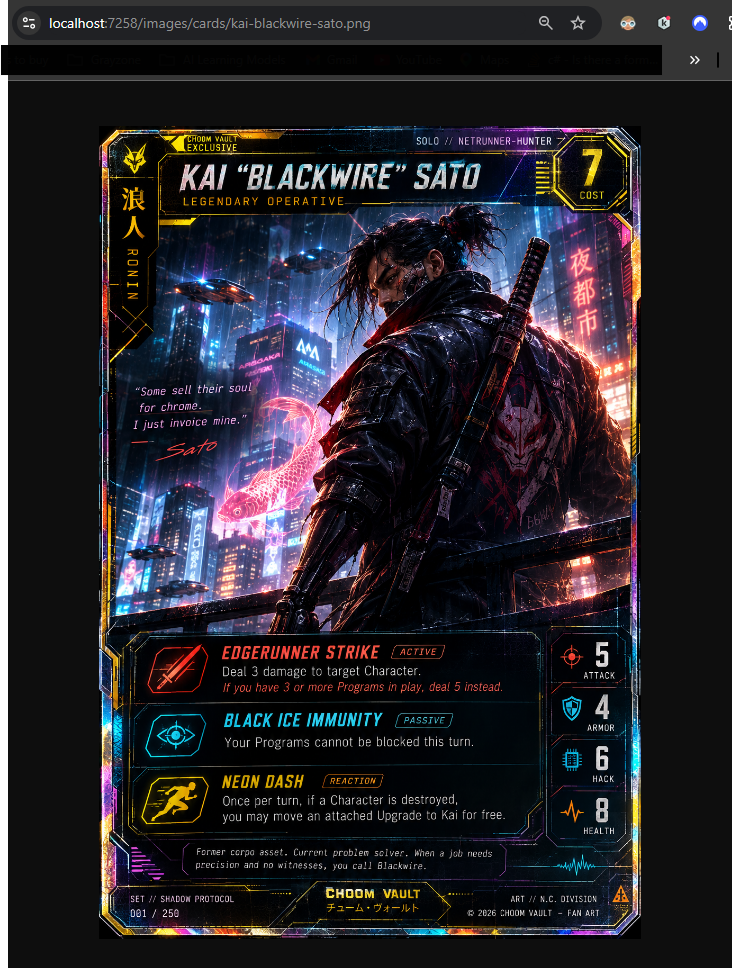

# Cyberpunk TCG Vault

[](https://github.com/Grit-Dev/CyberpunkTcgVault/actions/workflows/ci.yml)
[](https://github.com/Grit-Dev/CyberpunkTcgVault/actions/workflows/pages.yml)

**Cyberpunk TCG Vault — Choom Vault** is a full-stack collector companion built with **C#/.NET 10, ASP.NET Core, Angular, Entity Framework Core and SQL Server**.

It combines a secure API, a polished Angular catalogue experience and a growing set of collector-focused features for browsing cards and managing owned cards, wishlists and sealed products.

## Live Frontend

[View the deployed Angular frontend](https://grit-dev.github.io/CyberpunkTcgVault/)

> The Angular frontend is deployed through GitHub Pages.  
> API-backed catalogue behaviour currently runs against the ASP.NET Core API and SQL Server locally while the production API/Azure SQL deployment is prepared.

---

## Project at a Glance

### Backend

- ASP.NET Core Web API targeting **.NET 10 LTS**
- Entity Framework Core + SQL Server
- EF Core migrations
- JWT authentication
- ASP.NET Core password hashing
- Claims-based user identification
- Role-based Admin authorization
- User-owned private data
- Cross-user access protection
- Request and response DTOs
- Server-side catalogue filtering
- Structured logging
- Swagger / OpenAPI
- Automated backend tests
- GitHub Actions CI

### Frontend

- Angular + TypeScript
- Standalone components
- Angular Router
- Responsive homepage
- Vault Archive card catalogue
- Real ASP.NET Core API integration locally
- Database-backed card rendering
- Search and filtering
- Loading, error and no-results states
- Artwork fallback behaviour
- Keyboard/focus improvements
- Reduced-motion consideration
- Shared layout/navigation
- About, Privacy, Contact and Not Found surfaces
- GitHub Pages deployment

### Current Milestone

The next major engineering milestone is a public end-to-end deployment:

```text
Angular
   ↓ HTTPS
ASP.NET Core API
   ↓
Entity Framework Core
   ↓
Azure SQL
```

Before public collector accounts are opened more widely, the backend is being hardened around validation, database integrity, predictable errors, rate limiting, health checks, production configuration and integration testing.

---

## Product Direction

Choom Vault is intended to feel like a collector companion rather than a generic CRUD dashboard.

```text
DISCOVER
Home / Vault Archive

OWN
Card Detail / Collection / Wishlist / Sealed Products

EXPRESS
My Vault / Safehouse
```

The current product focus is the public catalogue, secure account/data foundations and the backend work required to support a real hosted collector MVP.

---

## Current Features

### Shared Card Catalogue

Cards are shared catalogue data rather than user-owned records.

Public reads:

```http
GET /api/Cards
GET /api/Cards/{id}
```

Admin-only mutations:

```http
POST   /api/Cards
PUT    /api/Cards/{id}
DELETE /api/Cards/{id}
```

The Angular Vault Archive consumes the Cards API and renders database-backed card data.

Catalogue filtering currently includes fields such as:

- Name
- Rarity
- Classification
- Card type

Read-only EF Core queries use patterns such as:

- `AsNoTracking()`
- database-side filtering
- deliberate response projection

This keeps filtering in SQL/EF Core rather than loading the complete catalogue into Angular.

### Deliberate API Contracts

The Cards API uses response DTOs rather than exposing EF Core persistence entities as the external HTTP contract.

```text
SQL Server
    ↓
EF Core query
    ↓
CardResponse DTO
    ↓
HTTP response
```

This keeps persistence concerns separate from the public API and gives the backend explicit control over what clients receive.

### Authentication

Users can register and log in through the API.

Passwords are never stored as plain text. ASP.NET Core password hashing is used to create and verify password hashes.

A successful login returns a signed JWT containing claims for:

- User ID
- Username
- Role

The API validates:

- Signature
- Issuer
- Audience
- Lifetime
- Signing key

Protected endpoints use:

```csharp
[Authorize]
```

Admin catalogue operations use:

```csharp
[Authorize(Roles = "Admin")]
```

### Current User Endpoint

The API includes:

```http
GET /api/Auth/me
```

This endpoint requires authentication and returns the current user represented by the validated JWT.

It is intended to support frontend session restoration and authenticated UI state while keeping the backend as the source of truth for identity and authorization.

### User-Owned Data

The backend currently supports three private user-owned areas:

- Owned Cards
- Wishlist Items
- Collection Products

The frontend does not decide which user owns a record.

The API reads the authenticated user ID from the JWT and filters database access using that identity.

```text
JWT
 ↓
Authenticated User ID
 ↓
Backend query
 ↓
UserId filter
 ↓
Only that user's records
```

This prevents one user from viewing, updating or deleting another user's private collection data.

Cross-user access deliberately returns:

```http
404 Not Found
```

rather than confirming whether another user's private record exists.

---

## API Overview

### Authentication

```http
POST /api/Auth/register
POST /api/Auth/login
GET  /api/Auth/me
```

### Cards

```http
GET    /api/Cards
GET    /api/Cards/{id}
POST   /api/Cards
PUT    /api/Cards/{id}
DELETE /api/Cards/{id}
```

`POST`, `PUT` and `DELETE` require the `Admin` role.

### Owned Cards

```http
GET    /api/OwnedCards
GET    /api/OwnedCards/{id}
POST   /api/OwnedCards
PUT    /api/OwnedCards/{id}
DELETE /api/OwnedCards/{id}
```

### Wishlist Items

```http
GET    /api/WishListItem
GET    /api/WishListItem/{id}
POST   /api/WishListItem
PUT    /api/WishListItem/{id}
DELETE /api/WishListItem/{id}
```

### Collection Products

```http
GET    /api/CollectionProducts
GET    /api/CollectionProducts/{id}
POST   /api/CollectionProducts
PUT    /api/CollectionProducts/{id}
DELETE /api/CollectionProducts/{id}
```

User-owned endpoints require authentication and operate only on the logged-in user's records.

---

## Security

The project currently demonstrates:

- Password hashing rather than plain-text storage
- JWT authentication
- JWT issuer, audience, signature and expiry validation
- Protected API endpoints
- Role-based Admin authorization
- Claims-based user identity
- Server-side ownership enforcement
- Cross-user access prevention
- JWT signing secrets stored outside source control
- Request DTOs controlling client input
- Response DTOs controlling API output
- Private collection data separated from public catalogue data
- Backend authorization rather than trusting frontend state

The Angular application may display authentication state and Admin controls, but it is **not** treated as the security boundary.

The ASP.NET Core API remains responsible for authentication, authorization, ownership and validation.

Production security hardening is part of the current MVP roadmap rather than being hidden after deployment.

---

## Testing and Continuous Integration

The backend test suite covers areas including:

- Card controller behaviour
- Card response contracts
- Owned-card ownership
- Wishlist ownership
- Collection-product ownership
- Cross-user access prevention
- User registration
- Duplicate username behaviour
- Password hashing
- Login success/failure
- JWT generation
- JWT identity and role claims
- Protected `/api/Auth/me` behaviour
- Admin authorization

Controller tests use the EF Core InMemory provider.

Direct controller tests manually provide authenticated claims where required because they do not execute the complete ASP.NET Core authentication middleware pipeline.

GitHub Actions provides CI checks for:

```text
Backend
restore → build → tests

Frontend
npm ci → tests → production build
```

The repository is pinned to a stable .NET 10 SDK through `global.json` so local and CI builds use the same supported runtime generation.

---

## Development Evidence

### Angular Card Catalogue API Integration



Demonstrates Angular consuming the ASP.NET Core API and rendering database-backed card records.

### Card Artwork Static File Hosting


Demonstrates ASP.NET Core serving card artwork from `wwwroot` and exposing image paths through API data.

Additional implementation screenshots are stored in:

```text
docs/screenshots/
```

---

## Tech Stack

### Backend

- C#
- .NET 10 LTS
- ASP.NET Core Web API
- Entity Framework Core
- SQL Server / LocalDB
- JWT Bearer Authentication
- ASP.NET Core Authorization
- Swagger / OpenAPI

### Frontend

- Angular
- TypeScript
- Angular Router
- Standalone components
- HTML
- SCSS
- Responsive layouts

### Testing and Tooling

- xUnit
- FluentAssertions
- EF Core InMemory provider
- Git
- GitHub
- GitHub Actions
- Visual Studio 2026
- Angular CLI
- Swagger
- SQL Server Management Studio

---

## Project Structure

```text
CyberpunkTcgVault/
│
├── CyberpunkTcgVault.Api/
│   ├── Controllers/
│   ├── Data/
│   ├── DTOs/
│   ├── Migrations/
│   ├── Models/
│   ├── Program.cs
│   └── appsettings.json
│
├── CyberpunkTcgVault.Api.Tests/
│   ├── Controllers/
│   └── TestHelpers/
│
├── CyberpunkTcgVault.Web/
│   ├── public/
│   ├── src/
│   │   ├── app/
│   │   ├── index.html
│   │   ├── main.ts
│   │   └── styles.scss
│   ├── angular.json
│   ├── package.json
│   └── tsconfig.json
│
├── docs/
│   └── screenshots/
│
├── global.json
├── README.md
└── CyberpunkTcgVault.sln
```

---

## Run Locally

### Prerequisites

- .NET 10 SDK
- Node.js LTS
- npm
- Angular CLI
- SQL Server LocalDB or SQL Server
- Git
- Entity Framework Core CLI tools

The repository contains a `global.json` file that pins the supported .NET 10 SDK used by the project.

### Clone and Build

```bash
git clone https://github.com/Grit-Dev/CyberpunkTcgVault.git
cd CyberpunkTcgVault

dotnet restore
dotnet build
dotnet test
```

### Local Database

Example LocalDB connection string:

```json
{
  "ConnectionStrings": {
    "DefaultConnection": "Server=(localdb)\\MSSQLLocalDB;Database=CyberpunkTcgVaultDb;Trusted_Connection=True;TrustServerCertificate=True;"
  }
}
```

Apply migrations:

```bash
dotnet ef database update --project CyberpunkTcgVault.Api
```

### JWT Development Secret

The JWT signing key must not be committed to source control.

From the API project:

```bash
cd CyberpunkTcgVault.Api
dotnet user-secrets init
dotnet user-secrets set "Jwt:Key" "replace-this-with-a-long-private-development-key"
```

`UserSecretsId` in the project file identifies the local secret store; it is not the JWT signing key itself.

### Run the API

From the repository root:

```bash
dotnet run --project CyberpunkTcgVault.Api
```

Swagger is available in the Development environment at the URL/port shown by the application.

### Run Angular

In a second terminal:

```bash
cd CyberpunkTcgVault.Web
npm install
ng serve --open
```

Default development URL:

```text
http://localhost:4200
```

---

## Roadmap to Hosted MVP

The immediate backend roadmap is intentionally focused on production readiness rather than adding architecture for appearance.

### Next

- Request DTO validation
- CancellationToken support across async API/EF Core operations
- Review/migrate user identifiers to GUIDs
- Card / CardPrinting domain decision and migration
- Database integrity constraints and indexes
- Predictable API errors using ProblemDetails
- Central current-user access
- Login/register rate limiting
- Health checks
- Production configuration and secrets
- Server-side catalogue pagination
- HTTP integration tests
- Meaningful entity timestamps

### Hosting

Target architecture:

```text
GitHub Pages / Angular
        ↓ HTTPS
Azure App Service / ASP.NET Core
        ↓
Azure SQL
```

The first hosted version will use safe project data/assets and will not depend on undocumented or unauthorized third-party APIs.

### Collector MVP

Once hosting and the Card/Printing ownership model are stable:

- Login / registration UI
- Auth/session restoration
- Card Detail
- Personal Collection
- Wishlist
- Sealed Products
- Account/security controls
- My Vault / Safehouse using real collector data

Later features such as MFA, advanced session management, public Safehouses, trading, messaging and deeper collector tools remain deliberately outside the first MVP.

---

## Development Approach

The project is developed incrementally with an emphasis on maintainability, security and understanding.

Features are kept simple until additional complexity is justified. Backend work is isolated into focused branches, tested, reviewed through pull requests and kept behind a green CI pipeline.

The project deliberately avoids adding patterns such as microservices, CQRS, MediatR or repository wrappers purely to make the architecture appear more complex.

---

## AI-Assisted Development

AI-assisted tools are used selectively for code review, debugging, accessibility review, refactoring suggestions, repetitive implementation, visual prototyping and explaining unfamiliar concepts.

AI is not treated as a substitute for understanding the application.

Architecture decisions, security behaviour, testing decisions and final committed changes are reviewed, tested and owned by the author.

---

## Repository Usage & Copyright

Copyright © 2026 Paul McGinley. All rights reserved.

This repository is publicly available for **portfolio review, technical evaluation and educational reference**.

**No open-source licence is currently granted.**

Subject to rights provided through GitHub's Terms of Service, public availability of this repository should not be interpreted as permission to reuse, redistribute, republish, sublicense, sell or incorporate the source code, original Choom Vault interface designs, branding or original project assets into another project or product without prior written permission.

Third-party names, trademarks and intellectual property remain the property of their respective owners.

Cyberpunk TCG Vault / Choom Vault is an **unofficial fan-made portfolio project** and is not affiliated with or endorsed by CD PROJEKT RED, WeirdCo or NetDeck.

---

## Author

Built by **Paul McGinley** as a full-stack C#/.NET and Angular portfolio project.
